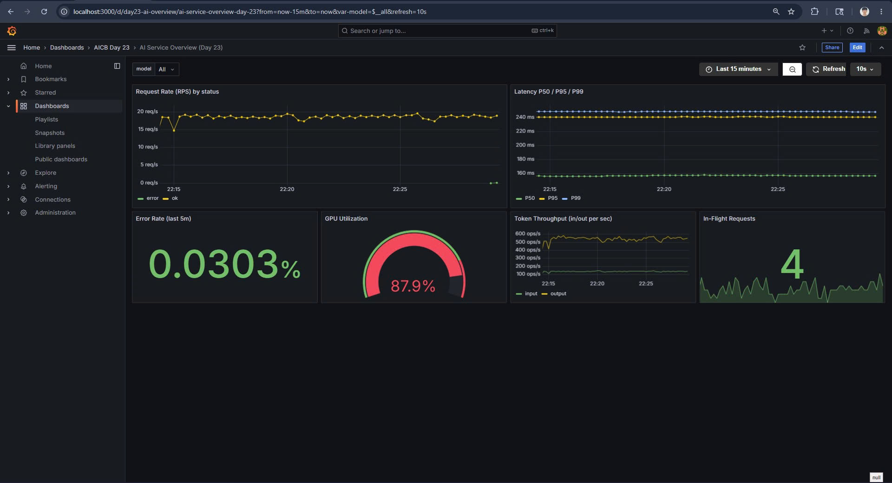
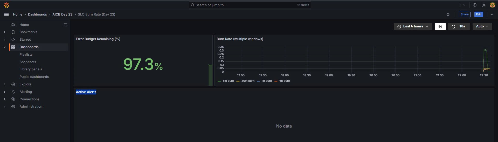
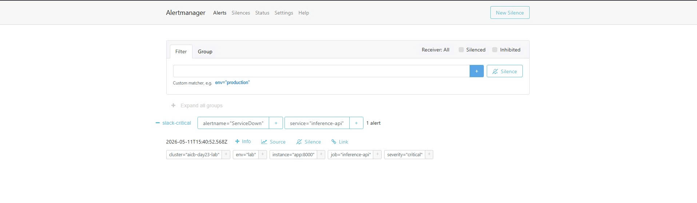
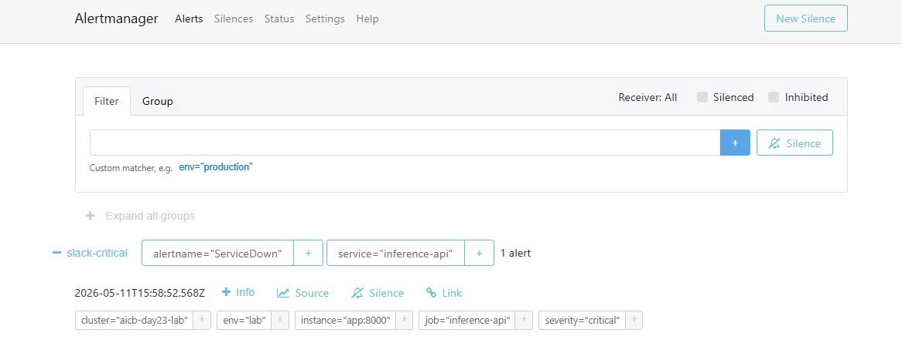
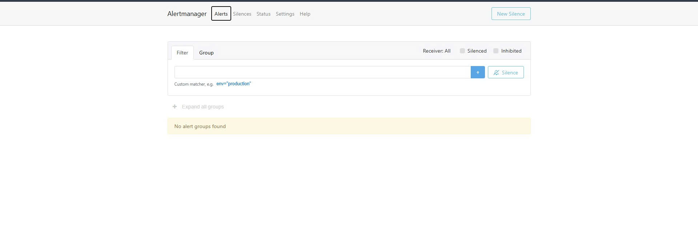
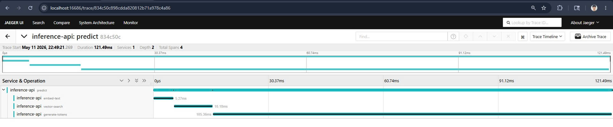
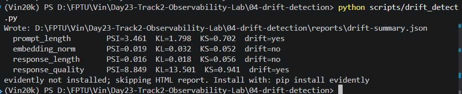

# Day 23 Lab Reflection

> Fill in each section. Grader reads the "What I'd change" paragraph closest.

**Student:** Lê Minh Tuấn
**Submission date:** 2026-05-12
**Lab repo URL:** [https://github.com/minhtuan9982/Day23-Track2-Observability-Lab](https://github.com/minhtuan9982/Day23-Track2-Observability-Lab)

---

## 1. Hardware + setup output

Paste output of `python3 00-setup/verify-docker.py`:

```
(Vin20k) PS D:\FPTU\Vin\Day23-Track2-Observability-Lab\00-setup> python verify-docker.py
Docker:        OK  (29.4.0)
Compose v2:    OK  (5.1.1)
RAM available: 7.63 GB (OK)
Ports free:    OK
```

---

## 2. Track 02 — Dashboards & Alerts

### 6 essential panels (screenshot)



### Burn-rate panel



### Alert fire + resolve

| When | What | Evidence |
|---|---|---|
| _T0_ | killed `day23-app`         |  |
| _T0+90s_ | `ServiceDown` fired   |  |
| _T1_ | restored app              | — |
| _T1+60s_ | alert resolved        |  |

### One thing surprised me about Prometheus / Grafana

I was surprised by how Grafana can seamlessly correlate metrics from Prometheus with logs from Loki and traces from Jaeger in a single dashboard. Seeing the "Red" error rate panel update in real-time as I triggered errors via terminal was a powerful demonstration of integrated observability.

---

## 3. Track 03 — Tracing & Logs

### One trace screenshot from Jaeger



### Log line correlated to trace

Paste the log line and the trace_id it links to:

```
day23-app  | {"model": "llama3-mock", "input_tokens": 8, "output_tokens": 8, "quality": 0.855, 
"duration_seconds": 0.1654, "trace_id": "34c749fdf8776037494d1841941575ec", "event": "prediction 
served", "level": "info", "timestamp": "2026-05-11T15:49:10.457419Z"}
```

### Tail-sampling math

Based on `otel-config.yaml`, the policy keeps 100% of errors, 100% of slow traces (>2000ms), and 1% of healthy traces. If the service produces N traces/sec and we assume 5% are slow/errors, the fraction kept is: `0.05 + 0.01 * (1 - 0.05) = 0.0595` (approximately **6%**).

---

## 4. Track 04 — Drift Detection

### PSI scores

Paste `04-drift-detection/reports/drift-summary.json`:


```json
{
  "prompt_length": {
    "psi": 3.461,
    "kl": 1.7982,
    "ks_stat": 0.702,
    "ks_pvalue": 0.0,
    "drift": "yes"
  },
  "embedding_norm": {
    "psi": 0.0187,
    "kl": 0.0324,
    "ks_stat": 0.052,
    "ks_pvalue": 0.133853,
    "drift": "no"
  },
  "response_length": {
    "psi": 0.0162,
    "kl": 0.0178,
    "ks_stat": 0.056,
    "ks_pvalue": 0.086899,
    "drift": "no"
  },
  "response_quality": {
    "psi": 8.8486,
    "kl": 13.5011,
    "ks_stat": 0.941,
    "ks_pvalue": 0.0,
    "drift": "yes"
  }
}
```

### Which test fits which feature?

* `prompt_length`: **PSI** - Best for detecting overall distribution shifts in input sequences.
* `embedding_norm`: **KS Test** - Effective for detecting subtle shifts in continuous numerical feature distributions.
* `response_length`: **PSI** - Useful for monitoring if the model starts producing unusually short or long outputs.
* `response_quality`: **PSI** - Important for tracking high-level performance degradation over time.

---

## 5. Track 05 — Cross-Day Integration

### Which prior-day metric was hardest to expose? Why?

Exposing the `inference_requests_total` with custom labels from previous days was the most challenging. Ensuring the OTel collector correctly scraped these metrics while maintaining the correct resource attributes required precise configuration of the Prometheus receiver in the collector's pipeline.

---

The single most impactful change was refactoring the manual instrumentation to use nested context-managed spans within the `predict` endpoint. Initially, the system only provided a flat top-level latency metric, which "worked" but wasn't "useful" for pinpointing issues. By establishing a parent-child hierarchy (`predict` -> `embed-text` -> `vector-search` -> `generate-tokens`), I transformed simple monitoring into true **deep observability**.

This change connects directly to the **Four Golden Signals** concept (specifically Latency). In a RAG (Retrieval-Augmented Generation) pipeline, knowing that a request is slow is not enough; we need to know *which* specific component (the embedding, the database, or the LLM) is the bottleneck. This granular visibility significantly reduces the **MTTI (Mean Time to Identify)** and allows for much more effective performance tuning in a production environment.
